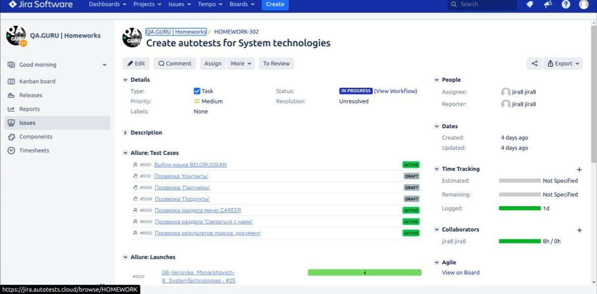

#   Проект для SystemTechnologies

 

## :gear: Использованы технологии:
| Java | Gradle | Junit5 | Selenide | GitHub | Jenkins | Selenoid | Allure Report | Allure TestOps | Jira | Telegram |
|:----:|:----:|:------:|:------:|:------:|:----:|:----:|:------:|:------:|:------:|:------:|
|  |  |  |  |  |  |  |  |  |  |  |

___

## :person_in_tuxedo: Запуск тестов происходит в CI [Jenkins](http://localhost:9090/job/08-Veronika_Monarkhovich-8_SystemTechnologies/)

 

Создаем config.properties:

```bash
src/test/resources/config/config.properties
```
Text File Content:
```bash
webUrl=https://www.st.by
remoteUrl=http://172.17.0.1:4444/wd/hub
```
Запуск тестов:
- в параметре DvideoStorage указываем место для сохранения видео
- в параметре Dbrowser задаем браузер
```bash
clean test -Dbrowser=${BROWSER} -DvideoStorage=http://localhost:8080/video/
```

Генерация отчета:
```bash
allure serve 
```
```bash
build/allure-results
```
___

## :bar_chart: Отчет генерируется в Allure


___

##  Тестовая документация, сгенерированная в Allure TestOps по итогам прохождения тестов

 

___
##  Задача в таск-трекере Jira с данными, экспортированными из Allure TestOps

 
___

## :calling: Уведомления о прохождение тестов отправляются в Telegram

 

___

## :movie_camera: Видеотчет теста "Проверка 'Связаться с нами'"

 