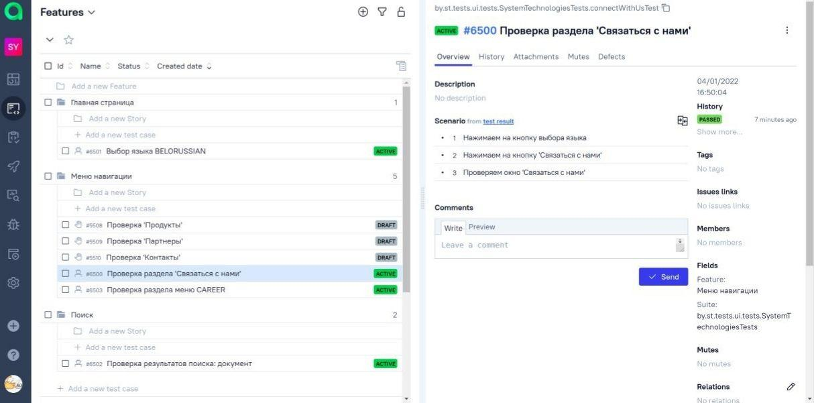
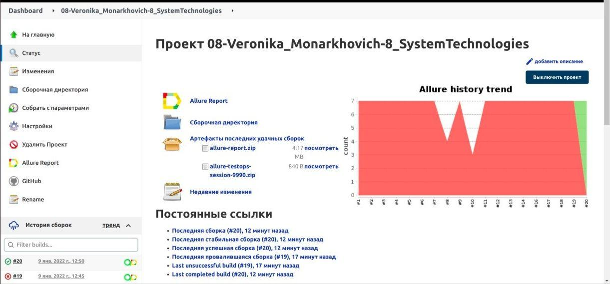

#   Проект для SystemTechnologies

 

## :gear: Использованы технологии:
| Java | Gradle | Junit5 | Selenide | GitHub | Jenkins | Selenoid | Allure Report | Allure TestOps | Jira | Telegram |
|:----:|:----:|:------:|:------:|:------:|:----:|:----:|:------:|:------:|:------:|:------:|
|  |  |  |  |  |  |  |  |  |  |  |

___

##  Проект создан в Allure TestOps
 

___

## :person_in_tuxedo: Запуск тестов происходит в CI [Jenkins](https://jenkins.autotests.cloud/job/08-Veronika_Monarkhovich-System_technologies/)

 

Создаем config.properties:

```bash
./src/test/resources/config/config.properties
```
Text File Content:
```bash
webUrl=https://www.st.by
remoteUrl = REMOTE_DRIVER_URL
```
Запуск тестов:
- в параметре DremoteDriverUrl - указываем логин, пароль и адрес удаленного сервера, где будут проходить тесты
- в параметре DvideoStorage указываем место для сохранения видео
- в параметре Dbrowser задаем браузер
```bash
gradle clean test -Dbrowser=${BROWSER}  -DremoteDriverUrl=${REMOTE_DRIVER_URL} -DvideoStorage=https://selenoid.autotests.cloud/video/
```

Генерация отчета:
```bash
allure serve 
```
```bash
build/allure-results
```
___

## :bar_chart: Отчет генерируется в Allure


___

## :calling: Уведомления о прохождение тестов отправляются в Telegram

 

___

## :movie_camera: Видеотчет теста "Проверка 'Связаться с нами'"

 